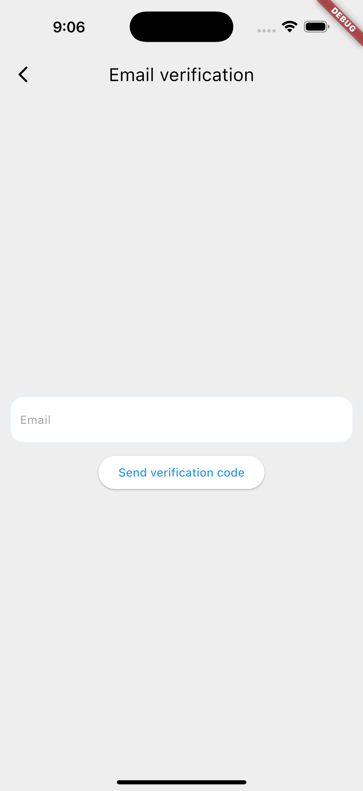
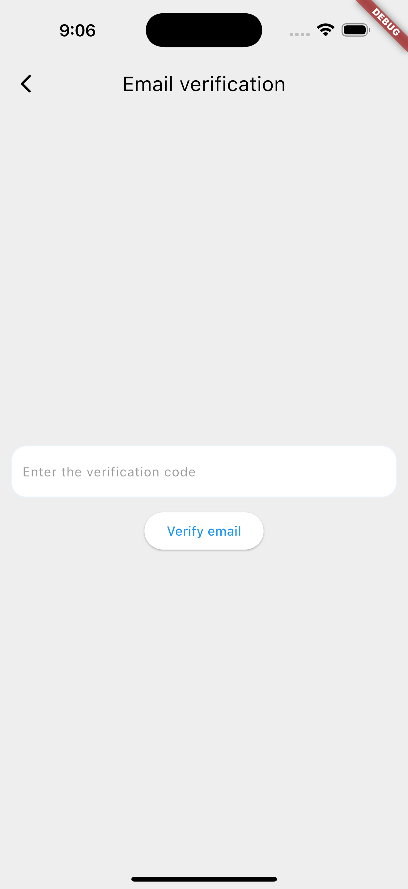
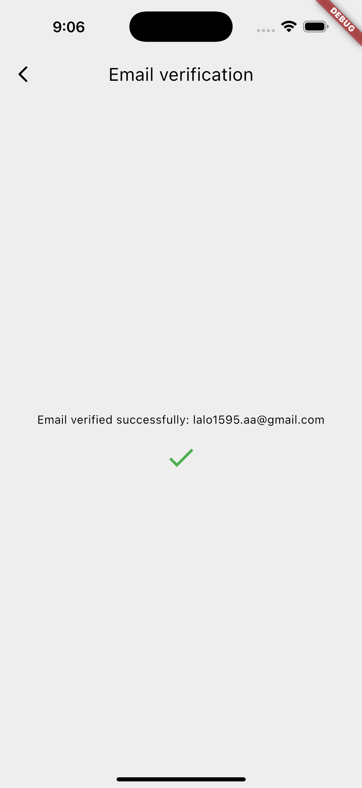
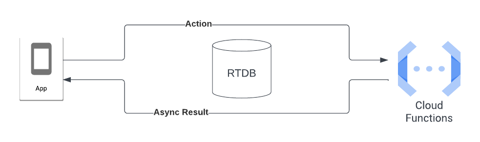
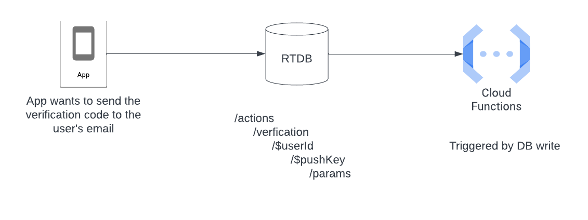
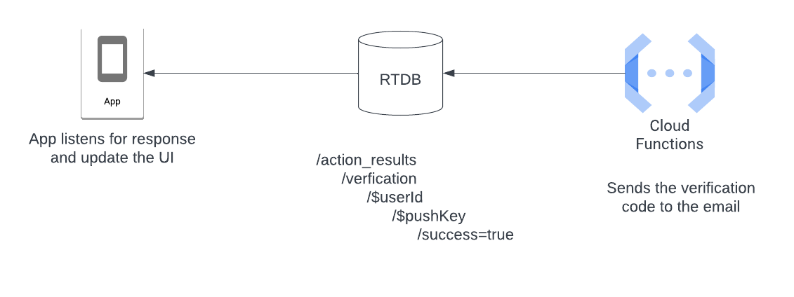
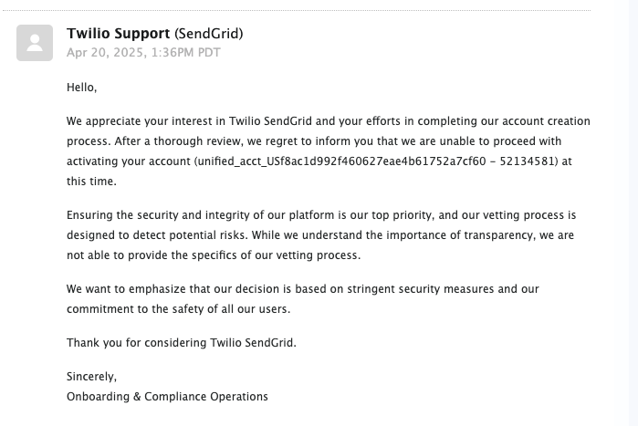

# firebase_verification

This Flutter application allows users to verify by code (OTP) via email using Firebase and a custom Cloud Function to send the code via email.

## Screenshots

## Demo

<video height="600" controls>
  <source src="docs/demo.mp4" type="video/mp4">
</video>

## Cloud Functions

The approach used to send the verification code to the user's email is based on using the `Cloud Functions` as an `API`. We write an Action in `RTDB`. The cloud function is activated, sends an email to the user, reading the data from `RTDB`, and when the email is sent, writes to `RTDB` the result. This way the user knows when the email was sent, and if an error occurred.

In a more detailed way, when the application wants to send the verification code to the user's email, it writes in `RTDB` in the `actions/verification/$uid/$pushKey` node, the data (`email`, `uid`, `type`, `timestamp`). The Cloud Function is activated when this new data is added in `RTDB`, it generates a `6 digit code`, and sends it to the user's email, and saves it in `Firestore`, together with the code.

When the verification code is sent successfully, the `Cloud Function` writes to `action_results/verification/$uid/$pushKey` the result of the action (`success = true`), and in case there is an error, it also saves it to `RTDB`. This way the application knows what the result of the action is and can update the UI according to the response.

## Send email with verification code 

I tried to use SendGrid for sending mails but I had problems when I created an account.

So I decided to use [nodemailer](https://www.npmjs.com/package/nodemailer) to send emails from the Cloud Functions.

# Starting 🚀

These instructions will allow you to obtain a copy of the application for testing.

## Getting Started
To build and run this project:

1. Get Flutter [here](https://flutter.dev) if you don't already have it
2. Clone this repository `git clone https://github.com/alvaroarmijos/firebase_verification`
3. `cd` into the repo folder `cd firebase_verification`
4. Sync the project `flutter pub get`
5. run `flutter run` to run the app.

## Running the example code

This sample requires Flutter 3.29.1

## Requirements 📋
You need these packages for the application to work
- Service Locator for DI: [get_it](https://pub.dev/packages/get_it "get_it")
- State management: [flutter_bloc ](https://pub.dev/packages/flutter_bloc "flutter_bloc ")
- Code generation for immutable classes: [freezed](https://pub.dev/packages/freezed "freezed")
